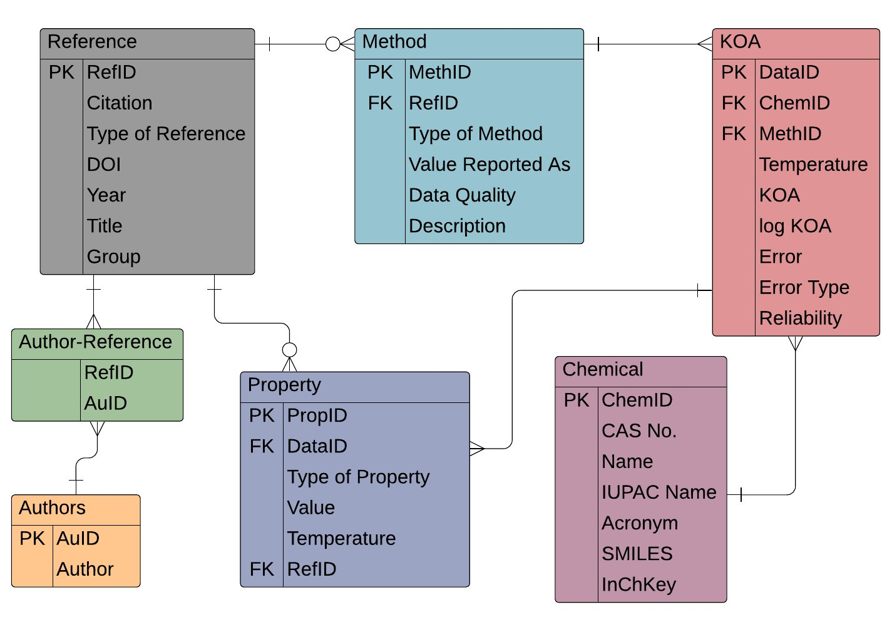

```{r, include = FALSE}
knitr::opts_chunk$set(
  collapse = TRUE,
  comment = "#>"
)

library(rmarkdown) #load the rmarkdown package - used only for rendering images and tables in this document
```


This package was created to make the *K*~OA~ database by *[Baskaran et al. 2021](https://www.doi.org/10.1063/5.0059652)* easily accessible and searchable. The data is stored as a SQL database however the functions will allow users to extract specific data. There are three main types of functions included. *Get* functions provide a list of variables that users may find helpful in running queries. *Table* functions which pulls all data from a specific table within the database. *Query* functions search and summarize data from the entire database.

```{r setup}
library(koadata) #load the koadata package
```


In all functions, the version of the database can also be specified. By default, they all use the latest version (and currently only version) of the database. If there are multiple versions of the database, they can be called and specified using the *ver* parameter.  


# *Get* Functions

The *Get* functions included here are to extract information that could be useful in querying the database where exact matches are necessary. No parameters for these functions need to be specified. Below we have outlined the information provided by using these *Get*  functions.

## Chemical Categories

Each chemical (or mixture) included in the database is listed in the chemical table of the database, however the categorization is simplified and is non-exhaustive. For example 1,4-Dichlorobenzene (CAS No. 106-46-7) is categorized as a chlorobenzene however is arguably also a Haloarene. These categorizations are intended for the purpose of improving the accessibility of the database for common chemical categories including PCBs, PAHs, PBDEs, and so on.

The *get.categories* function provides a list of unique chemical categories included in the database.


## Citations

Similar to the *get.categories* function, the *get.citations* function provides a list of citations for all references included in the database. 

## Research Groups

Based on the authors for each publication, we have assigned each reference to a research group. These groups are simplified, and as with the nature of research, some have worked collaboratively on various publications. Typically references from similar groups will utilize similar methods for measuring or estimating *K*~OA~. A unique list of reference groups in the database can be obtained by using the *get.groups* function


# *Table* Functions

The *K*~OA~ database contains multiple tables including chemical, methodological, reference, author, *K*~OA~ tables. Each of the tables can be extracted by using *table* functions. Below is a schematic of the *K*~OA~ database from *[Baskaran et al. 2021](https://www.doi.org/10.1063/5.0059652)*. 

```{r, echo = FALSE, out.width="75%", fig.cap = "Database schema, reproduced from *Baskaran et al. 2021*"}

```

Each of these tables contain specific data and can be extracted using *table* functions. For example, if you want to take a look at the Reference Table you would use the function ref.table(). 

```{r}
#table.ref()
```

This data frame contains 155 observations (rows) and 7 variables (columns). Here is a small subset of what the *references* variable output looks like.

```{r, echo = F}
references <- table.ref() 
paged_table(references, options = list(rows.print = 5, cols.print = 15)) 
```

Similarly you can extract the different tables in the database using the other *table* functions.

| Function | Table  | Description| 
| ------------- | -------------  | -------------| 
| table.au() | Author | Names of authors| 
| table.chem() | Chemical | Categories, CAS No., names, SMILES and other chemical identifiers| 
| table.koa()  | *K*~OA~ | Reported *K*~OA~ and log~10~ *K*~OA~ data, errors, notes| 
| table.meth() | Methods | Descriptions of each estimation & experimental techniques to obtain *K*~OA~| 
| table.prop() | Properties | Phys-chem properties used to calculate the *K*~OA~| 
| table.ref() | References | Citation details for all sources in the database| 

## Extracting subsets of data using *Table* functions

Some of these *table* functions allow you to extract a subset of data. For example, from the references table, we can identify all citations from the Harner group.

``` {r}

# table.ref("Harner")

#table.ref(query = "Harner") 

```

Or from more than one research group. 

``` {r}

#table.ref(query = c("Harner", "Carr"))

```

*Table* functions that allow for subsetting are:

* table.chem() --- specify the chemcial category/categories ("PCBs", "PAHs", etc.)
* table.meth() --- specify the type of method ("Dynamic", "Static", "Indirect", "EST")
* table.ref() --- specify the research group ("Harner", "Carr", "Abraham", etc.)
* table.prop() --- specify the property type ("log_KOW", "log_KAW", "VP", "Sw", "inf_act", "dG")


# *Query* Functions

The *query* functions are used to search the database directly and pull information from multiple tables at once. 

All query functions by default will provide the following information:

* CAS No. of the chemical
* Chemical Name (as listed in the database)
* Temperature (°C) of the *K*~OA~ value
* log~10~ *K*~OA~ value
* Method's score (0 to 4)
* Experimental or estimated value (EXP or EST)
* Method bin (QSPR, Solvation, RT, etc.)
* Citation
* Note on reliability
* Comments during data curation

## more.info Argument

If the more.info argument is specified as TRUE, then additional columns information is also extracted from the database:

* Chemical category
* All chemical names/synonyms and acronyms included in the database
* Molar mass of the chemical
* Type of method ("Dynamic", "Static", "Indirect", "EST")
* Specificity regarding the method (UPPER, COSMOtherm, SR-GC-RT, etc.)
* Type of octanol (wet or dry)
* Way the *K*~OA~ was original reported in the reference
* Reference Group

By default the more.info argument is FALSE.

## Query by CAS No.

This function can be used to extract *K*~OA~ information regarding a specific chemical with a known CAS No. The CAS No. does not need to include hyphens (-).

```{r}
# query.cas("87-82-1")
 
# query.cas("87821", more.info = T)
```

## Query by Name

Using the query.name function extracts *K*~OA~ information where the query matches a chemical name within the database. This search matches the names exactly to what is within the database. Only the common name as included in the database will be in the output. To include include all names from the databse in the output, more.info must be TRUE (default is FALSE).

```{r}

# query.name("PCB-82") #The name does not match what is in the database.

# query.name("PCB 82")

# query.name("PCB 82", more.info = T)
 
# query.name("o,p'-DDD")
 
# query.name("3-Methylbutan-2-one")
```

## Query by Category

*K*~OA~ data from all chemicals within a specific category can be extracted. To see chemical categories in the output, ensure more.info = T.

```{r}
#query.category("HCH")

#query.mass(350, 400, more.info = T)
```


## Query by Mass

The database can be queried to find *K*~OA~ data for chemicals with a specific molar mass or within a range of molar masses. By default the molar mass is not included in the output, specifying more.info as TRUE will include the molar mass in the output.

```{r}
#query.mass(350, 400)

#query.mass(350, 400, more.info = T)
```

To query a specific mass, specify the mass as both the upper and lower limit.

``` {r}
#query.mass(106.168, 106.168)
```

## Query by Citation

To pull all *K*~OA~ data from a specific citation or reference you can use the query.citation function. The queries must be exact matches to what is included in the database. To obtain a list of citations in the database, use the get.citations function.

```{r}
#query.citation("Meylan and Howard 2005")
```


## Query by Group

This functions allows you to obtain all data from a specific research group. The function below will pull all *K*~OA~ data from the work by the Carr group.

```{r}
# query.group("Carr")
```


## Multiple/batch Queries

Except for the query.mass function, the functions allow for multiple search parameters. Simply include all search terms as a list within the query argument.

```{r}
# query.cas(c("105-54-4", "319-85-7"))

# query.name(c("Dibromobisphenol A", "Barbital"))

# query.category(c("CDD", "CDF"))

# query.citation(c("Parnis et al. 2015", "Finizio et al. 1997"))

# query.group(c("Bidleman", "Chen"))
```


# Access the SQL Database Directly
For users who wish to access the SQL version of the database directly and perform custom queries the koa.database() function creates a connection to the database file. If used, the other functions within the package will not work correctly until the database is disconnected. 

```{r}
# conn <- koa.database()
# DBI::dbDisconnect(conn)
```
